# Arm Cortex-M55 enabled keyword spotting with echo cancellation

## Table of Contents

- [Introduction](#introduction)
  - [Keyword Spotting](#keyword-spotting)
  - [Machine Learning and Neural Networks](#machine-learning-and-neural-networks)
  - [Echo Cancellation and Noise Suppression](#echo-cancellation-and-noise-suppression)
  - [System Modeling and OpenModelica](#system-modeling-and-openmodelica)
  - [Arm Virtual Hardware](#arm-virtual-hardware)
  - [The Application](#the-application)
- [The Code Running on the Cortex-M55 Processor](#the-code-running-on-the-cortex-m55-processor)
  - [Principles of the Signal Processing Running on the Arm Virtual Hardware](#principles-of-the-signal-processing-running-on-the-arm-virtual-hardware)
    - [Beamformer](#beamformer)
    - [Adaptative Echo Canceller (AEC)](#adaptative-echo-canceller-aec)
    - [Noise Suppression](#noise-suppression)
  - [Integration of the Software Components on the Arm Virtual Hardware](#integration-of-the-software-components-on-the-arm-virtual-hardware)
- [Arm Virtual Hardware and OpenModelica](#arm-virtual-hardware-and-openmodelica) 
  - [Introduction](#introduction-1) 
  - [Arm Virtual Hardware](#arm-virtual-hardware-1) 
  - [OpenModelica](#openmodelica) 
  - [The Architecture](#the-architecture)
    - [Room Acoustic](#room-acoustic) 
    - [Limitations of the Current Model](#limitations-of-the-current-model) 
- [The Results](#the-results)
- [Conclusion](#conclusion)
- [References](#references)

## Introduction

This blog illustrates how to deploy a tinyML keyword spotting application on an embedded system with echo cancellation. I will demonstrate how to solve common challenges that might occur during development. This demo runs on [Arm Virtual Hardware](https://www.arm.com/products/development-tools/simulation/virtual-hardware) connected to a model of the external world.

### Keyword Spotting

Keyword spotting is the set of speech processing technologies used to identify a limited number of keywords.

One important use case of keyword spotting is wake word detection: a low power keyword spotting system waits for a wake word to wake the main system which is consuming more power and doing more processing. For instance, with some smart speakers you may use the word “Alexa” or “ok google”.

Keyword spotting is very common in embedded systems which, due to memory and performance constraints, can only recognize a very limited vocabulary on the device. It is also useful for privacy reasons: if you can do all the recognition on the device, you don’t need to connect to any cloud.

Keyword recognition may occur while the system is playing some sound. The microphone would therefore capture not only the speech to be recognized but also the sound from the speaker. For instance, it could occur during hands-free communication or while listening to some music on a smart speaker.

Keyword spotting has recently been using neural networks although other technologies are possible.

In this work, I am using the Neural Network from the [Microspeech](https://github.com/tensorflow/tflite-micro/tree/main/tensorflow/lite/micro/examples/micro_speech) example in the [TensorFlow Lite](https://github.com/tensorflow/tflite-micro) project.

### Machine Learning and Neural Networks

Machine learning systems need to be trained. The performance and complexity of the system will depend on the data used for the training.

For keyword spotting, I could just use a limited set of key words recorded in clean conditions: no noise, no echo. The neural network would be simpler but would not work well in real-world conditions involving background noise, echoes …

If I want the neural network to work in real-word conditions, then I will need to use training data containing different noisy environments. The data set will become much bigger, and it will imply that the neural network will have to be also more complex: more layers and/or layers with more neurons.

This might be too big for an embedded system that is constrained in processing power but also memory.

Therefore, on embedded systems, it is common to combine a simpler neural network with more advanced pre-processing.

This advanced pre-processing will improve the inference of the neural network by removing noise from the signal and extracting relevant features. This will enable the use of simpler neural networks (less layers and less neurons).

The training of the network may or may not involve this advanced pre-processing. It depends on the network and application. 

### Echo Cancellation and Noise Suppression

For this project, the pre-processing is implemented with a signal processing chain including a simplified [beamformer](https://en.wikipedia.org/wiki/Beamforming), an [adaptive echo canceller](https://en.wikipedia.org/wiki/Echo_suppression_and_cancellation) and noise suppression. The neural network has not been trained with this signal processing chain. I am using an already trained network and extending the possible uses of this network thanks to this additional advanced pre-processing.

The microphone that is capturing the speech which must be identified by the neural network is also capturing what is played on a speaker.

The goal of the signal processing chain is to remove, from the microphone recording, the sound coming from the speaker and to decrease the amount of background noise that may be present. This will allow the neural network to focus only on the speech.

The details about the principle of this signal processing are explained in the text below.

### System Modeling and OpenModelica

When the signal processing (DSP) is a simple input – output system, you can develop and test your signal processing chain and neural network (the total system) by connecting it to files containing the test patterns: the test files.

But, when the total system is relying on feedback loops, as is often the case with embedded systems, using test files is difficult since there is no feedback loop connecting the output files to the input files. In that case, a model of the external world (a virtual representation of the external world) is needed for the feedback loops.

You can of course implement an ad ’hoc solution. But modeling the environment is a lot of work and it is better to rely on existing technologies.

[OpenModelica](https://www.openmodelica.org/) is an open implementation of the [Modelica](https://modelica.org) standard : The [**Modelica**](https://modelica.org/) Language is a language for modeling cyber-physical systems.

I will use [OpenModelica](https://www.openmodelica.org/) to implement a model of the room acoustic. More details are given in the text below.

This model must then be connected to the code implementing the signal processing chain and the Neural Network.

### Arm Virtual Hardware

[Arm Virtual Hardware](https://www.arm.com/products/development-tools/simulation/virtual-hardware)  is an evolution of Arm's modelling technology delivering accurate models of Arm-based chips for application developers to build and test software before and after silicon and hardware availability.  It runs as a simple application in the cloud for simulating memory and peripherals, removing the complexity of building and configuring board farms for testing using modern agile software development practices such as continuous integration and continuous development CI/CD (DevOps) and MLOps workflows.

The [Arm Virtual Hardware](https://www.arm.com/products/development-tools/simulation/virtual-hardware) I am using is providing a model of the Arm [Cortex-M55](https://developer.arm.com/Processors/Cortex-M55) processor that is running native code.

The [Arm Virtual Hardware](https://www.arm.com/products/development-tools/simulation/virtual-hardware) services are currently available via the [Amazon Web Services (AWS) Marketplace](https://arm-software.github.io/VHT/main/infrastructure/html/index.html#AWS) and the [demo](https://github.com/ARM-software/VHT-SystemModeling) presented in this post can be run in the cloud.

### The Application

The picture above represents the [Modelica](https://modelica.org/) architecture of the system. The *echoCanceller* block is the [Arm Virtual Hardware](https://www.arm.com/products/development-tools/simulation/virtual-hardware) running all the [Cortex-M55](https://developer.arm.com/Processors/Cortex-M55) code. 

Each other block of this diagram is either representing another [Modelica](https://modelica.org/) diagram (like the *roomEcho* detailed in the text below) or a primitive block implementing a feature:

* Sources and speakers are interfacing with “.wav” files
* Microphones are implementing a gain 

The source blocks are the speaking people. The diagram may represent, for instance, a person receiving a call. The person receiving the call is on the near end. The person calling is on the far end.

In the case of hands-free communication, the microphones on the near end will also capture the sound made by the speaker on the near end. The goal of an echo canceller is to remove this background sound.

The *nearSource* is playing a pattern containing “Yes/No” keywords to be detected using the [Microspeech](https://github.com/tensorflow/tflite-micro/tree/main/tensorflow/lite/micro/examples/micro_speech) neural network from the [TensorFlow Lite](https://github.com/tensorflow/tflite-micro) (TFLite) examples. In the remaining part of this text, it will just be referred to as the Yes/No source.

The *farSource* is a background noise recorded by my team in a restaurant. In the remaining part of this text, it will be referred to as either echo or noise.

The *nearSpeaker* is playing what has been captured by the microphone on the far end.

There are two microphones on the near end to implement a beamformer in the code running on the [Arm Virtual Hardware](https://www.arm.com/products/development-tools/simulation/virtual-hardware).

The microphones on the near end are capturing the Yes/No pattern and the background noise played on the *nearSpeaker*. There is a feedback loop. One output of the system (the *nearSpeaker*) is influencing some inputs of the system: the near microphones.

Therefore, the person on the far end will not only hear the Yes/No pattern but will also hear an echo of the far end signal. 

The [Microspeech](https://github.com/tensorflow/tflite-micro/tree/main/tensorflow/lite/micro/examples/micro_speech) neural network (running on the [Arm Virtual Hardware](https://www.arm.com/products/development-tools/simulation/virtual-hardware)) would also receive this signal (echo + Yes/No) for the recognition if no pre-processing was applied.

The goal of the signal processing chain is to remove the echo so that the far end, and the [Microspeech](https://github.com/tensorflow/tflite-micro/tree/main/tensorflow/lite/micro/examples/micro_speech) network, are just receiving the Yes/No keywords without the background noise.

The *farSpeaker* is recording the output of the signal processing chain after the removal of the echo and noise.

Here is a picture of the signal at the input of the near end microphones. It is of very low amplitude. The Yes/No source is far from the microphones and the far end signal is mainly received through the echoes.

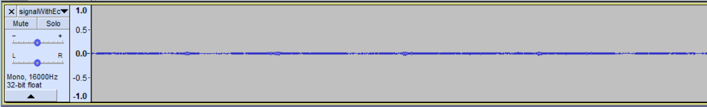

If I amplify it just for this presentation and to see the patterns more clearly, I get:

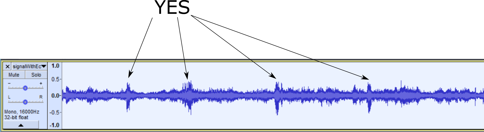

The output of the signal processing chain, recorded by the farSpeaker, is:

There is some residual echo at the beginning because it takes some time for the echo canceller algorithm to converge, and after the sequence of Yes/No words becomes visible.

 

The result of the [Microspeech](https://github.com/tensorflow/tflite-micro/tree/main/tensorflow/lite/micro/examples/micro_speech) network is displayed below:

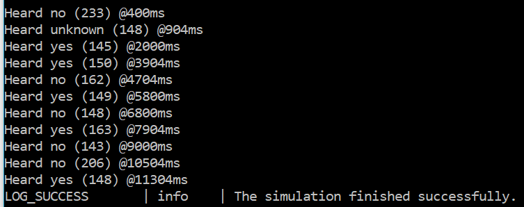

## The Code Running on the Cortex-M55 Processor

As described in the introduction, I am running real code on a model of a [Cortex-M55](https://www.arm.com/products/silicon-ip-cpu/cortex-m/cortex-m55) processor which is interacting with an external model. 

The [Cortex-M55](https://developer.arm.com/Processors/Cortex-M55) processor is the first Cortex-M that includes an implementation of the [Helium vector extension](https://www.arm.com/technologies/helium).

The [Cortex-M55](https://developer.arm.com/Processors/Cortex-M55) processor is specially adapted for efficient compute for increased DSP/ML performances. Arm is providing open-source optimized libraries like [CMSIS-DSP](https://github.com/ARM-software/CMSIS_5/tree/develop/CMSIS/DSP) and [CMSIS-NN](https://github.com/ARM-software/CMSIS_5/tree/develop/CMSIS/NN).

The first version of the echo canceller demo is not focused on optimizations but the integration of all the components needed for the full system. Therefore, the code running on the [Cortex-M55](https://developer.arm.com/Processors/Cortex-M55) processor is often the original code from the open-source projects without additional optimizations for this specific demo. Future releases will make more use of the capabilities of the [Cortex-M55](https://developer.arm.com/Processors/Cortex-M55) processor.

The DSP chain contains a beamformer, an adaptive echo canceller (AEC), and noise suppression.

The AEC and noise suppression come from the [libspeexDSP](https://gitlab.xiph.org/xiph/speexdsp) library. [libspeexDSP](https://gitlab.xiph.org/xiph/speexdsp) library has not yet been updated to make use of our [CMSIS-DSP](https://github.com/ARM-software/CMSIS_5/tree/develop/CMSIS/DSP) library and thus is not yet accelerated on the [Cortex-M55](https://developer.arm.com/Processors/Cortex-M55)  processor.

The beamformer is a very simple proof of concept for this demo.

The neural network is the [Microspeech](https://github.com/tensorflow/tflite-micro/tree/main/tensorflow/lite/micro/examples/micro_speech) example from the [TensorFlow Lite](https://github.com/tensorflow/tflite-micro) project. [TensorFlow Lite](https://github.com/tensorflow/tflite-micro) is already supporting [Cortex-M55](https://developer.arm.com/Processors/Cortex-M55) processor through the [CMSIS-NN](https://github.com/ARM-software/CMSIS_5/tree/develop/CMSIS/NN) library and is making use of the Helium vector extension for this demo. There is also some use of Helium instructions in the TensorFlow Lite [Microfrontend](https://github.com/tensorflow/tflite-micro/tree/main/tensorflow/lite/experimental/microfrontend).

### Principles of the Signal Processing Running on the Arm Virtual Hardware

Let’s quickly review the principles of the signal processing chain used in this demo for the beamformer, AEC and noise suppression.

#### Beamformer

If you add two waves, the result will depend on their relative delay. You may get a constructive (best case) or destructive interference (worst case).

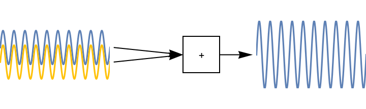

When the signals of the two near microphones are added, it is creating an interference because the micros are at different distances from the Yes/No source. Because of this, there is a relative delay between the two signals.

You can also see from the animation below that the interference is different for different wavelengths. Even if the source is always at the same distance from the microphones, the different frequencies will be attenuated differently because the number of wavelengths contained in this distance will be different.

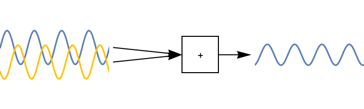

The room is modeled as shown in the next picture:

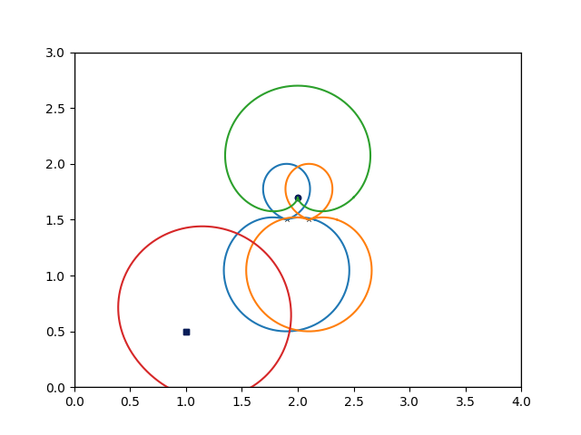

The red curve represents the directivity of the Yes/No source. The green curve represents the directivity of the speaker playing the far end signal (background noise). The two curves in the middle represent the directivity of the two microphones.

A directivity pattern represents the gain of a micro or speaker in each direction (the maximum gain being normalized to 1).

If I now compute the transfer function from the Yes/No source to the microphones, and taking into account the sum of the signals, I get something like:

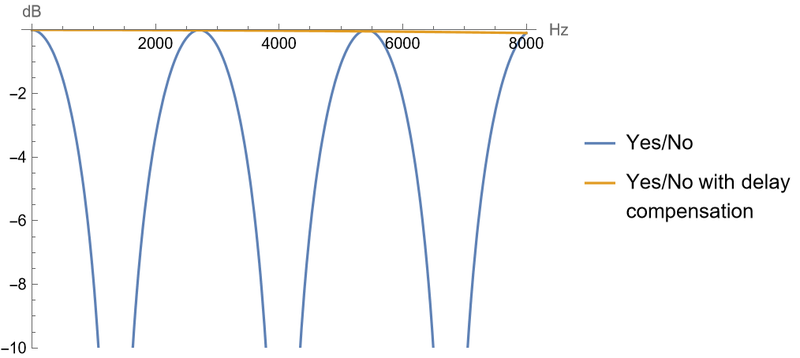

This picture shows that some frequencies are suppressed because of destructive interferences. 

If I take into account the relative delay between the two microphones, and compensate it before adding the signals, then I get a flat response: the frequencies are all in phase and there is constructive interference (The Yes/No with delay compensation on the previous picture).

This will happen only for the Yes/No source. For another source, with a different relative delay, our compensation has no effect, and some frequencies are still attenuated. But the attenuation may not occur at the same frequencies (depending on the position of the source).

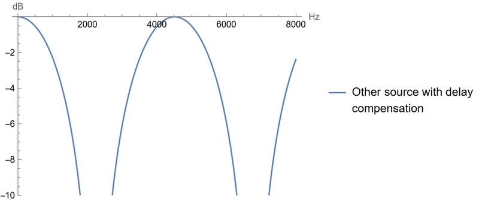

In summary, the beamformer is doing a delay and sum of the signal at the microphones. It has the effect of attenuating some frequencies of the background noise without modifying the signal. The signal to noise ratio is slightly improved.

In this demo, which is a proof of principle, the beamformer implementation is very limited:

* The relative delay is hardcoded (since the source is not moving). A real beamformer would estimate this delay at runtime 
* The delay compensation is using an integer delay (number of samples). A real beamformer would use a fractional delay
* The attenuation of the source signal reaching the microphones is not considered (the attenuation is different for both microphones due to different distances to the source)
* The directivity of the microphones is not taken into account (the angle of arrival is different for each microphone)

#### Adaptative Echo Canceller (AEC)

As illustrated from the animation below, the sound waves emitted from the speaker will reach the microphones either through a direct path or through the echoes.

Due to the directivity of the speaker and microphones, the direct path is less important in this demo.

I want to remove those echoes. I know what the signal is played on the speaker (it is the signal received from the far end).

Below picture is a picture of a simplistic view of the AEC flow.

The circles represent the sounds. In blue are the sounds that are known to the code running on the processor either because they are played by the processor or because they are recorded by the processor.

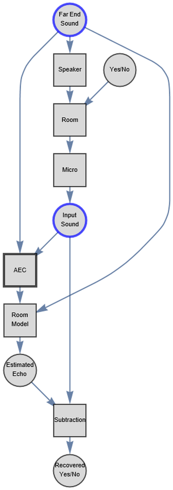

The microphone is receiving both the Yes/No pattern and the echoes. The echoes are generated from the far end signal played on the speaker.

The AEC is trying to model the transfer function of the extended room: speaker + room + microphones (named Room Model in the diagram but it is also containing speaker and micros).

If you have a good model of the room and since you know the far end signal which is played on the speaker, you can re-generate the echo. This re-generated echo can then be subtracted from the input signal to get a clean Yes/No signal.

The AEC is an adaptive system that is learning, at runtime, a model of the room. It is another example of machine learning. The frontier between DSP and ML is often tiny.

The AEC can only work if the Yes/No source is not always active. Also, the model is linear but there are often non linearities in the speaker.

Therefore, the estimated model is not perfectly accurate and after subtraction of the re-generated echo signal, there will be some remaining noise.

The next step in the chain is to remove some noise.

#### Noise Suppression

Here is the spectrogram of a noisy Yes.

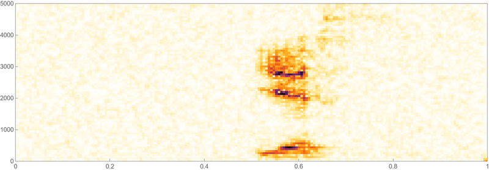

The noise suppression algorithm will estimate the noise level in the frequency bands where there is no speech, and it will then use this noise level to remove the noise in those frequency bands.

A noise suppression algorithm is learning the parameters of a noise model and using it to filter out the noise from the signal. It is another example of machine learning since the algorithm is learning at the runtime of the parameters of such a model.

### Integration of the Software Components on the Arm Virtual Hardware

I now have several components coming from the DSP chain (Beamformer, AEC, noise suppression), and from the [Microspeech](https://github.com/tensorflow/tflite-micro/tree/main/tensorflow/lite/micro/examples/micro_speech) example ([Microfrontend](https://github.com/tensorflow/tflite-micro/tree/main/tensorflow/lite/experimental/microfrontend) MFCC, [TensorFlow Lite](https://github.com/tensorflow/tflite-micro) network). I also have some sinks and sources for the data (microphones and speakers).

How do I integrate all those components? I have a system that is based on streams of sound samples. But I have components that use fixed size buffers. How do I map the streaming model onto a buffer-based model?

Although it can be done manually, it makes things more difficult when you want to experiment with your system, change the parameters, use other components …

Let’s see what’s the issue in a simple (but not too realistic example). Assume you have a source that is producing five samples and a sink that is consuming seven samples. How do you schedule those components to implement a streaming solution? How do you size the necessary FIFO connecting the two components?

If I start with an empty FIFO, a possible schedule would be (with FIFO size after execution in parenthesis):

* Source (5)
* Source (10)
* Sink (3)
* Source (8)
* Sink (1)
* Source (6)
* Source (11)
* Sink (4)
* Source (9)
* Sink (2)
* Source (7)
* Sink (0)

At the end of this sequence of calls, the FIFO is empty again so I can execute the schedule once more. Therefore, I have a periodic schedule enabling to process a never-ending stream of samples.

Here is an animated result:

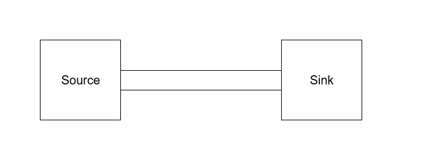

There are several possibilities to find and implement such a schedule:

* At runtime, use a dynamic scheduler which will analyze the state of FIFOs to determine which component to run
* Manually by hardcoding the schedule
* Using a static scheduler that generates this sequence of calls

 

In our open-source IoT library for general purpose compute ([CMSIS-DSP](https://github.com/ARM-software/CMSIS_5/tree/develop/CMSIS/DSP)), I have introduced an experimental technology: A [synchronous dataflow](https://github.com/ARM-software/CMSIS_5/tree/develop/CMSIS/DSP/SDFTools) scheduler. It is a set of Python scripts and C++ templates. You can describe the compute graph in Python, and it will generate a static schedule and size all the FIFOs.

 

The [Synchronous Data Flow](https://github.com/ARM-software/CMSIS_5/tree/develop/CMSIS/DSP/SDFTools) (SDF) for the total system implemented in this demo is represented as follow:

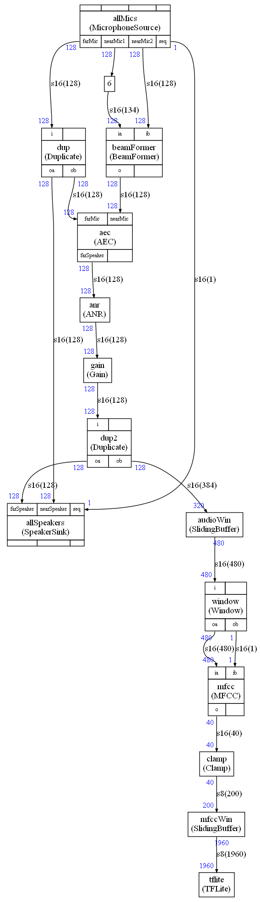

There are several things to notice:

* The [Microspeech](https://github.com/tensorflow/tflite-micro/tree/main/tensorflow/lite/micro/examples/micro_speech) example has been decomposed into a few components:
  * *audioWin* : A sliding buffer for audio
  * *Window* : A Hann window applied to the signal
  * The *MFCC* ([Microfrontend](https://github.com/tensorflow/tflite-micro/tree/main/tensorflow/lite/experimental/microfrontend) processing)
  * *Clamping* from [Microspeech](https://github.com/tensorflow/tflite-micro/tree/main/tensorflow/lite/micro/examples/micro_speech)
  * *mfccWin* : A sliding buffer for MFCC
* All the micros and all the speakers are in their own SDF components and there is a “seq” arc between the micros and the speakers:
  * It is a way to represent an external constraint on the scheduling:
* I want the speaker and the microphone component executions to be interleaved
* The [TensorFlow Lite](https://github.com/tensorflow/tflite-micro) (TFLite) component does not perform the inference:
  * It wakes up the ML thread to do the inference and reads the result of the last inference
* There is a gain at the output of the signal processing because the signal is of low amplitude when reaching the near end microphones in this demo.

The *mfccWin* is a new component compared to the original [Microspeech](https://github.com/tensorflow/tflite-micro/tree/main/tensorflow/lite/micro/examples/micro_speech) example: This component is used to define by how many samples the audio window is sliding between each attempt at recognizing a word. It controls how often the software wakes-up the ML thread and in this demo, 0.1s is used.

A new TFLite inference is made each time 200 new samples are available at the input of the *mfccWin* component. Each time there are 200 new samples at the input of this component, there are 1960 new samples generated at the output and there is enough data available to launch a new TFLite inference.

Each *MFCC* is generating 40 samples. To get the 200 samples, the scheduler needs to execute 200/40 = 5 *MFCCs*.

Each *MFCC* needs 480 audio samples, but because of the sliding buffer *audioWin*, the 480 samples are generated each time 320 samples are coming from the audio.

Therefore, to be able to start a new inference, the scheduler needs 5*320=1600 new audio samples. Since the demo is using a sampling rate of 16 kHz, those 1600 samples represent 0.1 s.

The microphone and speaker components in the graph are the interfaces with the hardware for the audio. Note that the implementation of those components is a proof of principle. There are lots of limitations in those sinks and sources so they should not be used for a real implementation.

## Arm Virtual Hardware and OpenModelica

### Introduction

In the previous section, I explained what the compute graph is running on the [Cortex-M55](https://developer.arm.com/Processors/Cortex-M55) processor.

This compute graph must take its samples from somewhere and, because of the requirements of echo cancelling, there must be a feedback loop: the output of our compute graph must influence the input of the compute graph.

Therefore, our [Arm Virtual Hardware](https://www.arm.com/products/development-tools/simulation/virtual-hardware) must be connected to an external model: a virtual representation of the external world. The external model is implemented using [OpenModelica](https://www.openmodelica.org/) which is an open implementation of the [Modelica](https://modelica.org/) standard. [OpenModelica](https://www.openmodelica.org/) generates the C sources for a simulator from a model description. I call it “The simulator” or “The [Modelica](https://modelica.org/) simulator” in the following description.

Here is the architecture of the system:

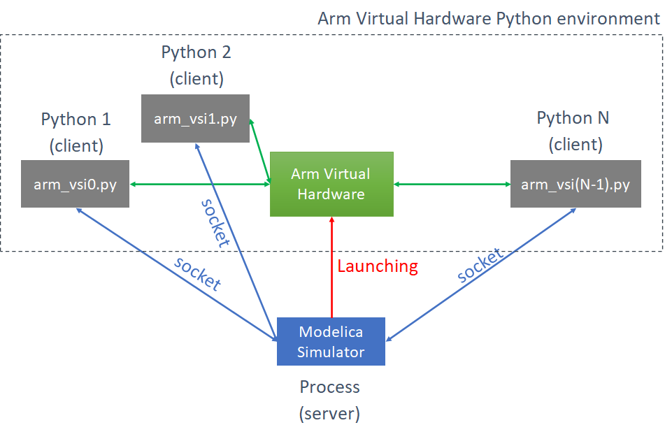

The [Arm Virtual Hardware](https://www.arm.com/products/development-tools/simulation/virtual-hardware) is the model containing the [Cortex-M55](https://developer.arm.com/Processors/Cortex-M55) processor.

The generated C source includes some [Modelica](https://modelica.org/) extensions I have developed to communicate with the [Arm Virtual Hardware](https://www.arm.com/products/development-tools/simulation/virtual-hardware).

The simulator is launching the [Arm Virtual Hardware](https://www.arm.com/products/development-tools/simulation/virtual-hardware). The virtual peripherals are implemented with Python scripts that are connecting to the simulator.

At the end of the simulation, the simulator stops the execution of the [Arm Virtual Hardware](https://www.arm.com/products/development-tools/simulation/virtual-hardware).

### Arm Virtual Hardware 

[Arm Virtual Hardware](https://www.arm.com/products/development-tools/simulation/virtual-hardware) is described [here](https://arm-software.github.io/VHT/main/overview/html/index.html):

https://www.arm.com/products/development-tools/simulation/virtual-hardware

 

You can access it from the AWS Marketplace to run this demo in the cloud.

### OpenModelica

I have developed some [Modelica](https://modelica.org/) blocks to be used in this demo. Since the process implementing the [Arm Virtual Hardware](https://www.arm.com/products/development-tools/simulation/virtual-hardware) has a name generally starting with VHT (for Virtual Hardware Target), the [Modelica](https://modelica.org/) blocks are using VHT in their naming. The implementation of those blocks is indeed specific to this implementation of the [Arm Virtual Hardware](https://www.arm.com/products/development-tools/simulation/virtual-hardware).

* The Arm package is containing
  * Some blocks to read/write wav files (with very limited support for full wav format)
  * A digital FIR
  * Some blocks to communicate with the VHT process
* The Echo package containing:
  * A description of the architecture
  * Two implementations of the architecture:
    * One with the block representing the VHT process
    * One without the VHT block to just experiment with the echoes

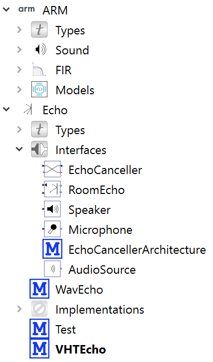

### The Architecture

The architecture is defined with the following [OpenModelica](https://www.openmodelica.org/) diagram.

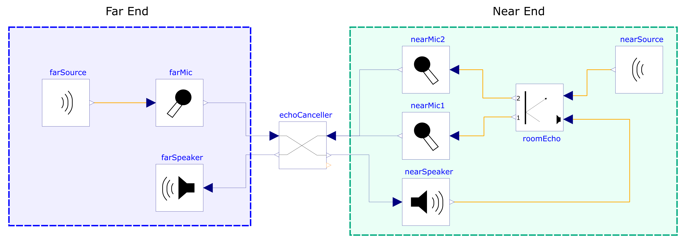

In the *VHTEcho* implementation, the block *echoCanceller* contains the [OpenModelica](https://www.openmodelica.org/) block I have developed, which is used to implement the communication between the VHT and the simulator.

In the *WavEcho* implementation, the *echoCanceller* block is just a pass-through block.

#### Room Acoustic

The *roomEcho* node uses finite impulse response filters (FIR) to model the room transfer functions for the different paths:

* Near speaker to mic 1
* Near speaker to mic 2
* Near source to mic 1 
* Near source to mic 2

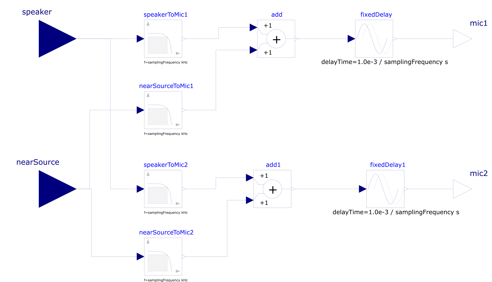

The FIRs are generated using the [PyRoomAcoustic](https://github.com/LCAV/pyroomacoustics) Python package.

I have defined the following microphones and speakers for this demo as already explained:

#### Limitations of the Current Model

The model of the feedback loop is simplified in this demo and a more complex model would introduce:

* A frequency response for the microphones and speakers
* Non-linearities for the speaker
* Non-stationary room impulse responses (the Yes/No source may be moving or its orientation changing)

With [OpenModelica](https://www.openmodelica.org/), an electro-mechanical model of the speaker could be built and would model the frequency response and non-linearities of the speaker.

Because the current model of the room is simplified, the performance of the signal processing chain (Beamformer + AEC + noise suppression) is much better in the demo than it would be with a more complex and realistic model.

## The Results

The result of the simulator is containing a trace of all the signals in the [Modelica](https://modelica.org/) model. I have written a Python script that extracts the cleaned signal and the result of the recognition.

This script can be run in the cloud.

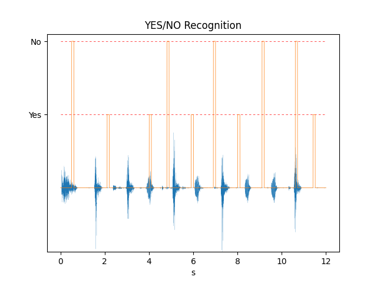

The [Microspeech](https://github.com/tensorflow/tflite-micro/tree/main/tensorflow/lite/micro/examples/micro_speech) settings used in this demo prevent the system from recognizing words too close in time. There is a delay between the appearance of a word and the moment when the [Microspeech](https://github.com/tensorflow/tflite-micro/tree/main/tensorflow/lite/micro/examples/micro_speech) software decides that a word has been recognized. For this decision, the [Microspeech](https://github.com/tensorflow/tflite-micro/tree/main/tensorflow/lite/micro/examples/micro_speech) software uses several recognitions from the [TensorFlow Lite](https://github.com/tensorflow/tflite-micro) network.

That’s why on the previous graph there is a delay between the recognition and the word patterns. The delay can also be observed in the following animation:

## Conclusion

Designing a total system including tiny ML, signal processing, streaming computation and feedback loops coming from the external world is not easy. For embedded systems, it is important to be able to use simpler neural networks in more varied environments.

Before going to the real hardware implementation, it is great to have the possibility to test all the components with a model of the environment and with a software architecture close to the final system.

The combination of the [Arm Virtual Hardware](https://www.arm.com/products/development-tools/simulation/virtual-hardware) with [OpenModelica](https://www.openmodelica.org/) made all this process simpler and accelerated the development of the full system.

The use of echo cancellation and noise suppression increased the performance of the keyword recognition. It extended the possible environments where the [Microspeech](https://github.com/tensorflow/tflite-micro/tree/main/tensorflow/lite/micro/examples/micro_speech) neural network can be used without having to rely on a more complex neural network.

The use of libraries like [CMSIS-NN](https://github.com/ARM-software/CMSIS_5/tree/develop/CMSIS/NN) (and [CMSIS-DSP](https://github.com/ARM-software/CMSIS_5/tree/develop/CMSIS/DSP) in a future version) enabled efficient processing making use of all the capabilities of the [Cortex-M55](https://developer.arm.com/Processors/Cortex-M55)  processor.

You can now play with the demo by cloning our [VHT-SystemModeling GitHub](https://github.com/ARM-software/VHT-SystemModeling) repository and running it in the cloud.

To get started on this example, [click here](https://github.com/ARM-software/VHT-SystemModeling/blob/main/EchoCanceller/Documentation/QUICKSTART.md).

For more detailed documentation about how to run and build, [click here](https://github.com/ARM-software/VHT-SystemModeling/blob/main/EchoCanceller/README.md).

## References

* [CMSIS-DSP](https://github.com/ARM-software/CMSIS_5/tree/develop/CMSIS/DSP)
* [CMSIS-NN](https://github.com/ARM-software/CMSIS_5/tree/develop/CMSIS/NN)
* [Cortex-M55 processor](https://www.arm.com/products/silicon-ip-cpu/cortex-m/cortex-m55)
* [Helium Vector Extensions](https://www.arm.com/technologies/helium)
* The [speex DSP library](https://gitlab.xiph.org/xiph/speexdsp) from the [speex project](https://www.speex.org/)
* The [PyRoomAcoustic python library](https://github.com/LCAV/pyroomacoustics)
* The experimental [CMSIS-DSP Synchronous Dataflow](https://github.com/ARM-software/CMSIS_5/tree/develop/CMSIS/DSP/SDFTools) 
* [OpenModelica](https://www.openmodelica.org/)
* [Modelica standard](https://modelica.org/modelicalanguage.html)
* [VHT-SystemModeling](https://github.com/ARM-software/VHT-SystemModeling)
* [Arm Virtual Hardware](https://www.arm.com/products/development-tools/simulation/virtual-hardware)
* [Virtual Hardware GitHub](https://arm-software.github.io/VHT/main/overview/html/index.html)
* The [Microspeech](https://github.com/tensorflow/tflite-micro/tree/main/tensorflow/lite/micro/examples/micro_speech) demo
* [TensorFlow Lite](https://github.com/tensorflow/tflite-micro)
* TensorFlow Lite [Microfrontend](https://github.com/tensorflow/tflite-micro/tree/main/tensorflow/lite/experimental/microfrontend)

