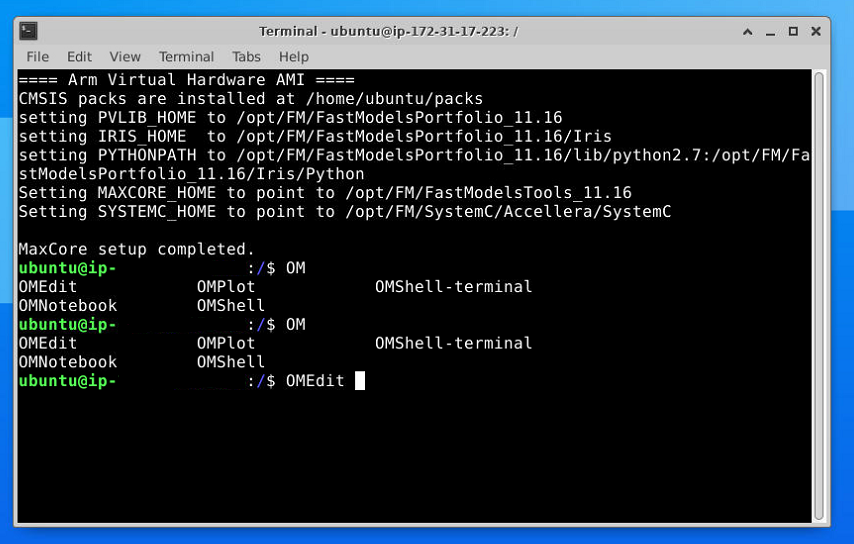

# BUILDING AND RUNNING THE DEMO

Before trying to build and run the demo, additional tools must be installed.

## In the cloud

You first need to run an ArmVirtualHardware-1.1.0 image from the  Amazon Web Services (AWS) Marketplace.

Connect to your EC2 instance and follow the below explanations.

## In local

If you are running the demo in local and not the cloud, the explanations are the same for Linux (the Python version may have to be changed in the scripts).

We also provide some instructions to build and run on Windows at the bottom of this page.

## Installing additional tools

### Installing some Python modules

Those modules are required for the script which is processing the output of the simulation and generating a plot.

On the cloud, the default version is `python3.8` so the command is :

`python3.8 -m pip install numpy matplotlib DyMat scipy`

### Installing OpenModelica

#### On Linux

To install [OpenModelica](https://www.openmodelica.org/), follow instruction from [Linux OpenModelica](https://www.openmodelica.org/download/download-linux) pages for installation in the cloud.

Install **stable** . The demo is using `Modelica-4.0` library. It is not installed with the **release**

All libraries must be installed.

You don't need to install the C++ runtime.

After installation, you can do:

`apt-cache search "omlib-.*" | grep "omlib-modelica-4.0.0"`

and look for a `Modelica 4.0.0` library. If you see it, then the next steps should work.

#### On Windows

Just get the [Windows version](https://www.openmodelica.org/download/download-windows)

## Clone the repository

`git clone https://github.com/ARM-software/VHT-SystemModeling.git`

## Building the .axf to be run on the Arm Virtual Hardware with CMSIS command line tools

`cd VHT-SystemModeling/EchoCanceller`

There is already a pre-built `EchoCanceller.axf` in `EchoCanceller/Objects` but if you want to rebuild it:

Install the [CMSIS](https://github.com/ARM-software/CMSIS_5) packs using CMSIS Build tools:

`cpackget pack add -a -f packlist`

Build the project using CMSIS Build tools:

`cbuild.sh EchoCanceller.MainApp.cprj`

You need to have the CMSIS Build tools installed (`cpackget` and `cbuild.sh`). In the cloud, they are installed by default. In local you'll have to install them or use an IDE to install the packs and build (as explained at bottom of this page).

#### Build settings

This section is not required to build the demo. But, in case you may want to experiment with the code and change a few things, it is useful to know what compilation flags are used and why.

The build is using the following defines:

```__FVP_PY ARM_DSP_CONFIG_TABLES ARM_FAST_ALLOW_TABLES ARM_FFT_ALLOW_TABLES ARM_TABLE_REALCOEF_Q15 ARM_TABLE_TWIDDLECOEF_Q15_256 ARM_TABLE_BITREVIDX_FXT_256 ARM_TABLE_TWIDDLECOEF_Q15_128 ARM_TABLE_BITREVIDX_FXT_128 ARM_ALL_FAST_TABLES ARM_MATH_LOOPUNROLL DISABLEFLOAT16```

Those options are used by [CMSIS-DSP](https://github.com/ARM-software/CMSIS_5) to include only the needed FFT tables.

The current version is not yet using [CMSIS-DSP](https://github.com/ARM-software/CMSIS_5) FFT (currently it is still using  [KissFFT](https://github.com/mborgerding/kissfft)).

The code is compiled with -O1. If you compile with optimizations, the code size will be bigger and you may need to resize the ITCM in the FVP configuration file and in the memory mapping.

`-DMICROSPEECH` is defined on the `sources` folder to enable the calls to the [TFLite](https://github.com/tensorflow/tflite-micro) network.

`-DHAVE_CONFIG_H -DOS_SUPPORT_CUSTOM` are defined on the `echocanceller` folder. Those flags are used by the [speex DSP library](https://gitlab.xiph.org/xiph/speexdsp) to include some configuration files.

Note that the  [KissFFT](https://github.com/mborgerding/kissfft) CMSIS pack (one of the dependencies of the [TFLite](https://github.com/tensorflow/tflite-micro) CMSIS pack) is not used. So, the pack manager in the MDK may display an error.

We are instead using the [KissFFT](https://github.com/mborgerding/kissfft) from the [speex DSP library](https://gitlab.xiph.org/xiph/speexdsp) because the [speex DSP library](https://gitlab.xiph.org/xiph/speexdsp) has created some variants of the  [KissFFT](https://github.com/mborgerding/kissfft) APIs.

In a future version, we will rework the  [KissFFT](https://github.com/mborgerding/kissfft) files in the [speex DSP library](https://gitlab.xiph.org/xiph/speexdsp) to be able to use the CMSIS pack.

## Building the Modelica model from command line

### Building the Modelica Model and running the simulation on Linux

The Modelica simulator is the executable generated by [OpenModelica](https://www.openmodelica.org/) tools from the description of your model.

#### Building and running the Simulation

Go to the `buildC` folder inside the `EchoCanceller` folder:

`cd BuildC`

`sh buildAndRun.sh`

This script will :

- compile the [Modelica](https://www.openmodelica.org/) model to C code
- compile the C code to generate a [Modelica](https://www.openmodelica.org/) simulator
- Update the parameters of the simulation
- Launch the [Modelica](https://www.openmodelica.org/) simulator (which will launch the [Arm Virtual Hardware](https://arm-software.github.io/VHT/main/overview/html/index.html) )
- Generate a plot from the output of the [Modelica](https://www.openmodelica.org/) simulator using Python

#### Simulator building phase

During compilation of the [Modelica](https://www.openmodelica.org/) model to C code, you should see (on the cloud):

```
"/home/ubuntu/VHT-SystemModeling/EchoCanceller/BuildC"
"/home/ubuntu/VHT-SystemModeling/VHTModelicaBlock/ARM/package.mo"
"/home/ubuntu/VHT-SystemModeling/EchoCanceller/EchoCanceller.mo"
true
true
true
true
true
{"/home/ubuntu/VHT-SystemModeling/EchoCanceller/BuildC/Echo.VHTEcho","Echo.VHTEcho_init.xml"}
```

If you see any false, it means one of the commands in the script `echoLinux.mos` has failed.

If you're running in local, your paths may be different.

#### Simulation running phase

If this is successful and the [Arm Virtual Hardware](https://arm-software.github.io/VHT/main/overview/html/index.html) has been launched, you should see the output:


It is a mix of output from the [Arm Virtual Hardware](https://arm-software.github.io/VHT/main/overview/html/index.html) and from the [Modelica](https://www.openmodelica.org/) simulator.

VHT is the name of the implementation of the [Arm Virtual Hardware](https://arm-software.github.io/VHT/main/overview/html/index.html) which is used and it means : Virtual Hardware Target.

Once the simulation has booted, you should start to see some keyword recognition in the console.


When the simulation has ended, the folder should contain the two files:

- YesNoResult.png
- cleanedSignal.wav

`YesNoResult.png` is the far end signal and the keyword recognition.


`cleanedSignal.wav` is the far end signal used for keyword recognition.

You can re-run the simulation with the command:

`sh run.sh`

This command is not rebuilding the [Modelica](https://www.openmodelica.org/) simulator but just updating the parameters and launching the demo. Therefore, if you change some parameters in the Python script `params.py`, you just need to relaunch the simulation with `run.sh`. No need to rebuild a simulator.

You can also use the scripts with the option noecho

- `sh buildAndRun.sh noecho`
- `sh run.sh noecho`

With the option `noecho`, the [Modelica](https://www.openmodelica.org/) simulator used will be `Echo.WavEcho` instead of `Echo.VHTEcho`. This simulator is not using the [Arm Virtual Hardware](https://arm-software.github.io/VHT/main/overview/html/index.html) . The VHT block is replaced by a pass-through block. The simulation will generate a `signalWithEcho.wav` with no echo cancellation. It is useful to have an idea of what is the signal with no pre-processing.

This is not exactly the same signal has the one used by the [Arm Virtual Hardware](https://arm-software.github.io/VHT/main/overview/html/index.html) because the signal processing chain running on [Arm Virtual Hardware](https://arm-software.github.io/VHT/main/overview/html/index.html) is adding a small delay in the loop. So the far end source is slightly delayed compared to the simulation with no signal processing.

If you use the `run.sh` script, you must use the `buildAndRun.sh` script at least once before and with the same option.

### Building the Modelica Model and running the simulation on Windows

Building on Windows is very similar but there is a little additional difficulty.

Go to the `EchoCanceller\BuildC` folder and type the command:

`"%OPENMODELICAHOME%\bin\omc.exe" echoWindow.mos`

It will compile the Modelica model to C, compile the C and launch a simulation which will quickly fail because the default paths are not right.

Then you can edit the `params.py` script, in `BuildC` folder, to edit the paths and launch `run.bat` script to launch the simulation again.

The difference between `echoLinux.mos` and `echoWindow.mos` is that `echoLinux.mos` is using the OpenModelica](https://www.openmodelica.org/) command `buildModel(Echo.VHTEcho)` to generate the C. And then, you need to use `make`.

On Windows, the `clang` needed for building with `make` is inside the [OpenModelica](https://www.openmodelica.org/) folders but not easy to use (paths to set etc ...). So, instead the script is replacing the `buildModel` command by `simulate(Echo.VHTEcho);`

This `simulate` command is also building the C with the [OpenModelica](https://www.openmodelica.org/) `clang`. Like that it is easier to build the `.exe` 

The only problem is that it is launching a simulation before we have the opportunity to edit the simulation parameters. So, this first simulation will fail. 

## Building from OpenModelica OMEdit graphical user interface

If you don't want to use the command line for building and running the simulation, you can use the  [OpenModelica](https://www.openmodelica.org/) graphical user interface `OMEdit`

If you're building in the cloud, you need to connect with [VNC](https://arm-software.github.io/VHT/main/infrastructure/html/run_ami_local.html#use_vnc) as explained on our [documentation](https://arm-software.github.io/VHT/main/infrastructure/html/run_ami_local.html#use_vnc)

On Linux, to be sure the paths are set correctly and the [Arm Virtual Hardware](https://arm-software.github.io/VHT/main/overview/html/index.html)  libraries can be found by [OpenModelica](https://www.openmodelica.org/), you need to launch `OMEdit` from a shell. Here is the expected output when you do it in the cloud (the IP displayed will depend on your VM in the cloud):



The first time `OMEdit` is launched, it will ask for which version of the Modelica standard library to use. You need to select version 4.0:


Then, you need to load the ARM package using the File -> Open Model/Library File(s)


Finally, you can open the `EchoCanceller.mo` model found in the folder `EchoCanceller`. Use the same menu command : File -> Open Model/Library File(s)

If you got the project from github and installed in your home in the cloud, the paths are correct.

Otherwise, you'll need to edit the absolute paths.

Open the `VHTEcho` block. Select the source code view and edit the paths:


Then, open the `VHTCanceller` block in the package `Implementations` and edit the paths:


Once the paths are correct, you can then :

- Open the `VHTEcho` block in the Modeling perspective
- Click on the `S` button in the top bar to launch a simulation.

Try first with a 1 second simulation to see if it is working. Then you can try with 12 seconds (the duration of the `yes/no` pattern).

If the progress bar is frozen at 0% for too long, cancel the simulation and:

- Look at the [OpenModelica](https://www.openmodelica.org/) `OMEdit` console for error messages (some will be displayed only when the simulation is cancelled)
- Check if all VHT processes have been killed 

Generally the problem is a wrong path somewhere. When everything is working, the window should look like this:


At the end of the simulation, you'll be able to use the Variables window to explore the result of the simulation:


If you select the signal `farSpeaker` and `tf` in the block echoCanceller, you'll see the results of the simulation similar to what is displayed by the Python script. `tf` signal at 2 means "NO" and 1 means "YES". 0 is unknown or silence.

## Building and running with an IDE (like uVision)

### Building

An IDE can also be used to compile the `.axf` if you don't have the CMSIS Build tools installed.

The project `EchoCanceller.uvprojx` can be used for `uVision`.

Some packs will have to be installed. Most are available from the pack manager.

But the synchronous data flow (SDF) pack is still experimental and [available from the CMSIS-DSP project](https://github.com/ARM-software/CMSIS_5/tree/develop/CMSIS/DSP/SDFTools).

You can use the `ARM.SDF.0.3.0.pack`.

### Running

In case of the use of an IDE, [OpenModelica](https://www.openmodelica.org/) must not launch the [Arm Virtual Hardware](https://arm-software.github.io/VHT/main/overview/html/index.html) since the [Arm Virtual Hardware](https://arm-software.github.io/VHT/main/overview/html/index.html) will be launched from the IDE.

The `params.py` script in folder `BuildC` must be modified to disable the automatic launch:


`false` must be used in above line.

Once this change is done, you first launch the Modelica simulator as explained above either using the `run.sh`/`run.bat` script or the `buildAndRun.sh`

The simulator will launch and wait for an [Arm Virtual Hardware](https://arm-software.github.io/VHT/main/overview/html/index.html) to connect. You should see:


Then, you can go to your IDE and launch the simulation. [Arm Virtual Hardware](https://arm-software.github.io/VHT/main/overview/html/index.html) will be launched and will connect to the Modelica simulation.

You should see the simulation starting in the Modelica simulator's console:


And in the IDE (`uVision` example), you should see:


If the simulator was build and run from the `OMEdit` UI then the procedure is the same:

- You need to set the parameter `launchVHT` to `false` in the block `echoCanceller.vhtMulti`
  - It can be changed in the `Variables` window and the simulation just relaunched after this change
  - Or it can be changed in the source code and the simulation rebuilt after this change
- You need to launch the simulation from `OMEdit`
- Then you can start the simulation in the IDE
