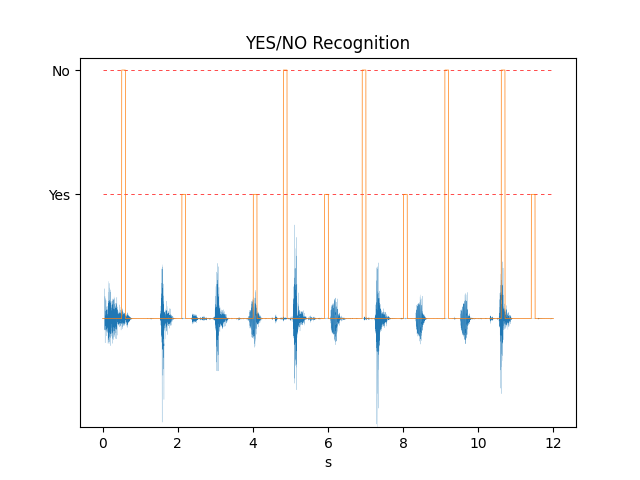

# BUILDING AND RUNNING THE DEMO

## Building the .axf to be run on the VHT

`cd VHTModelicaDemos/EchoCanceller`

There is already a pre-built `EchoCanceller.axf` in `EchoCanceller/Objects` but if you want to rebuild it:

Install the [CMSIS](https://github.com/ARM-software/CMSIS_5) packs:

`cp_install.sh packlist`

Build the project

`cbuild.sh EchoCanceller.Demo.cprj`

### Build settings

This section is not required to build the demo. But, in case you may want to experiment with the code and change a few things, it is useful to know what compilation flags are used and why.

The build is using the following defines:

```__FVP_PY ARM_DSP_CONFIG_TABLES ARM_FAST_ALLOW_TABLES ARM_FFT_ALLOW_TABLES ARM_TABLE_REALCOEF_Q15 ARM_TABLE_TWIDDLECOEF_Q15_256 ARM_TABLE_BITREVIDX_FXT_256 ARM_TABLE_TWIDDLECOEF_Q15_128 ARM_TABLE_BITREVIDX_FXT_128 ARM_ALL_FAST_TABLES ARM_MATH_LOOPUNROLL DISABLEFLOAT16```

Those options are used by [CMSIS-DSP](https://github.com/ARM-software/CMSIS_5) to include only the needed FFT tables.

The current version is not yet using [CMSIS-DSP](https://github.com/ARM-software/CMSIS_5) FFT (currently it is still using  [KissFFT](https://github.com/mborgerding/kissfft)).

The code is compiled with -O1. If you compile with optimizations, the code size will be bigger and you may need to resize the ITCM in the FVP configuration file and in the memory mapping.

`-DMICROSPEECH` is defined on the `sources` folder to enable the calls to the [TFLite](https://github.com/tensorflow/tflite-micro) network.

`-DHAVE_CONFIG_H -DOS_SUPPORT_CUSTOM` are defined on the `echocanceller` folder. Those flags are used by the [speex DSP library](https://gitlab.xiph.org/xiph/speexdsp) to include some configuration files.

Note that the  [KissFFT](https://github.com/mborgerding/kissfft) CMSIS pack (one of the dependencies of the [TFLite](https://github.com/tensorflow/tflite-micro) CMSIS pack) is not used. So, the pack manager in the MDK may display an error.

We are instead using the [KissFFT](https://github.com/mborgerding/kissfft) from the [speex DSP library](https://gitlab.xiph.org/xiph/speexdsp) because the [speex DSP library](https://gitlab.xiph.org/xiph/speexdsp) has created some variants of the  [KissFFT](https://github.com/mborgerding/kissfft) APIs.

In a future version, we will rework the  [KissFFT](https://github.com/mborgerding/kissfft) files in the [speex DSP library](https://gitlab.xiph.org/xiph/speexdsp) to be able to use the CMSIS pack.


## Installing some Python modules

Those modules are required for the script which is processing the output of the simulation and generating a plot.

`python3.8 -m pip install numpy matplotlib DyMat scipy`

## Building the Modelica Simulator and running the simulation

### Installing Modelica

To install [Modelica](https://www.openmodelica.org/), follow instruction from [Linux Modelica](https://www.openmodelica.org/download/download-linux) pages.

Install **stable** . The demo is using `Modelica-4.0` library. It is not installed with the **release**

All libraries must be installed.

After installation, you can do:

`apt-cache search "omlib-.*"`

and look for a `Modelica-4.0` library. If you see it, then the next steps should work:

### Running the Simulation

Go to the `buildC` folder inside the `EchoCanceller` folder:

`cd BuildC`

`sh buildAndRun.sh`

This script will :

- compile the [Modelica](https://www.openmodelica.org/) model to C code
- compile the C code to generate a [Modelica](https://www.openmodelica.org/) simulator
- Update the parameters of the simulation
- Launch the [Modelica](https://www.openmodelica.org/) simulator (which will launch the [VHT](https://arm-software.github.io/VHT/main/overview/html/index.html))
- Generate a plot from the output of the [Modelica](https://www.openmodelica.org/) simulator

### Simulator building phase

During compilation of the [Modelica](https://www.openmodelica.org/) model to C code, you should see:

```
"/home/ubuntu/VHTModelicaDemos/EchoCanceller/BuildC"
"/home/ubuntu/VHTModelicaDemos/VHTModelicaBlock/ARM/package.mo"
"/home/ubuntu/VHTModelicaDemos/EchoCanceller/EchoCanceller.mo"
true
true
true
true
true
{"/home/ubuntu/VHTModelicaDemos/EchoCanceller/BuildC/Echo.VHTEcho","Echo.VHTEcho_init.xml"}
```

If you see any false, it means one of the commands in the script `echoLinux.mos` has failed.

### Simulation running phase

If this is successful and the [VHT](https://arm-software.github.io/VHT/main/overview/html/index.html) has been launched, you should see the output:


It is a mix of output from the [VHT](https://arm-software.github.io/VHT/main/overview/html/index.html) and from the [Modelica](https://www.openmodelica.org/) simulator.

Once the simulation has booted, you should start to see some keyword recognition in the console.


When the simulation has ended, the folder should contain the two files:

- YesNoResult.png
- cleanedSignal.wav

`YesNoResult.png` is the far end signal and the keyword recognition.



`cleanedSignal.wav` is the far end signal used for keyword recognition.

You can re-run the simulation with the command:

`sh run.sh`

This command is not rebuilding the [Modelica](https://www.openmodelica.org/) simulator but just updating the parameters and launching the demo.

You can also use the scripts with the option noecho

- `sh buildAndRun.sh noecho`
- `sh run.sh noecho`

With the option `noecho`, the [Modelica](https://www.openmodelica.org/) simulator used will be `Echo.WavEcho` instead of `Echo.VHTEcho`. This simulator is not using the [VHT](https://arm-software.github.io/VHT/main/overview/html/index.html). The VHT block is replaced by a pass-through block. The simulation will generate a `signalWithEcho.wav` with no echo cancellation. It is useful to have an idea of what is the signal with no pre-processing.

This is not exactly the same signal has the one used by the VHT because the VHT signal processing chain is adding a small delay in the loop. So the far end source is slightly delayed compared to the simulation with no VHT.

If you use the `run.sh` script, you must use the `buildAndRun.sh` script at least once before and with the same option.


