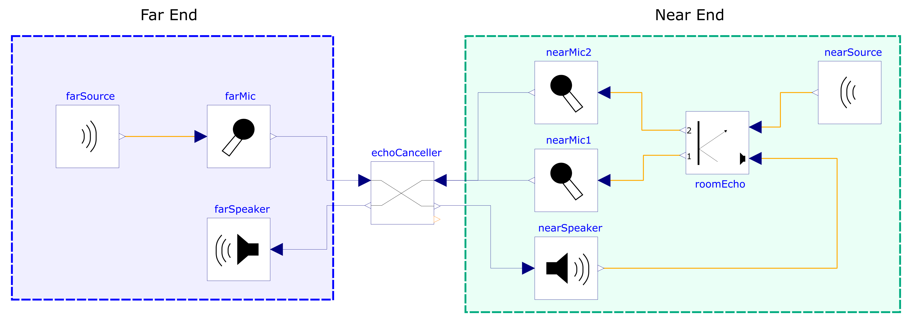
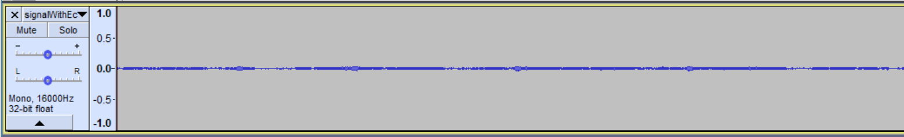
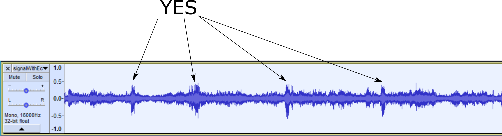
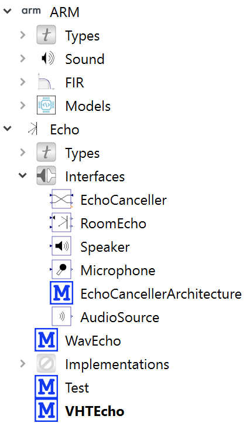
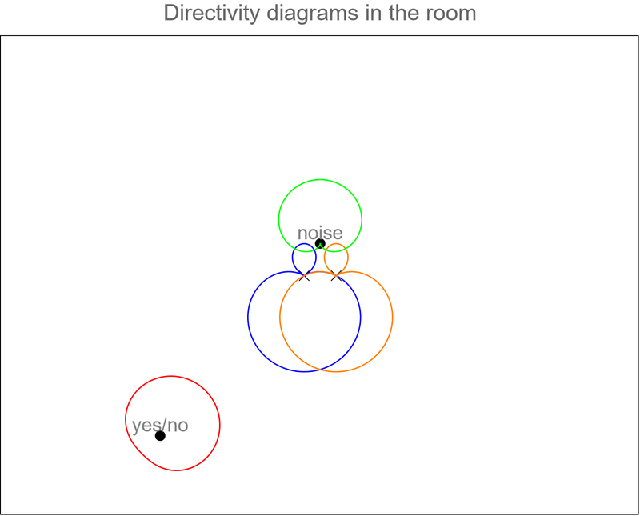

# Echo Canceller and Keyword spotting on Virtual Hardware

## Introduction

This demo is integrating software for an echo canceller and keyword spotting. The code is running on a Cortex-M55 on the [ARM Virtual Hardware](https://arm-software.github.io/VHT/main/overview/html/index.html) . The [Arm Virtual Hardware](https://arm-software.github.io/VHT/main/overview/html/index.html) is interacting with a model of the room acoustic implemented with [OpenModelica](https://www.openmodelica.org/).

The simulation is containing two simulators:

- The [ARM Virtual Hardware](https://arm-software.github.io/VHT/main/overview/html/index.html) where the Cortex-M55 application is run
- The simulator generated with  [OpenModelica](https://www.openmodelica.org/). It is implementing a model of the room acoustic 

The simulator is launching the [Arm Virtual Hardware](https://arm-software.github.io/VHT/main/overview/html/index.html) .

The [Arm Virtual Hardware](https://arm-software.github.io/VHT/main/overview/html/index.html) is connecting to the [Modelica](https://www.openmodelica.org/) simulator using sockets.

The [Modelica](https://www.openmodelica.org/) simulator is implementing the acoustic of a room as described on the Modelica architecture diagram.

A farSource (background voices) is played through the nearSpeaker and captured by the near microphones (either through direct pass from the speaker to the micros or through the room echo).

The nearSource is playing a `yes/no` signal.

We want to detect the `yes/no` keywords and remove the background noise.

The echo canceller and noise reduction (and simplified beamformer) are cleaning the signal before recognition by the Tensor Flow Lite network.

The cleaned signal is also sent back to the far end.

This demo is using:

* The [speex DSP library](https://gitlab.xiph.org/xiph/speexdsp) from the [speex project](https://www.speex.org/)
* The [PyRoomAcoustic python library](https://github.com/LCAV/pyroomacoustics)
* The experimental [CMSIS-DSP Synchronous Dataflow](https://github.com/ARM-software/CMSIS_5/tree/develop/CMSIS/DSP/SDFTools) 
* [OpenModelica](https://www.openmodelica.org/)
* The OpenModelica VHT block developed internally
* The [ARM Virtual Hardware](https://arm-software.github.io/VHT/main/overview/html/index.html)
* The [Microspeech](https://github.com/tensorflow/tflite-micro/tree/main/tensorflow/lite/micro/examples/micro_speech) demo
* And a very simplified beam former

The sound files used for tests are:

* Some background sound recorded with a mobile phone by our team

* `yesno.wav` was created from the test files in the [Microspeech](https://github.com/tensorflow/tflite-micro/tree/main/tensorflow/lite/micro/examples/micro_speech) demo : less silence between the words and some background noise.

# The results

The "yes" / "no" signal is the signal we want to keep. The background signal is the far end signal we want to remove.

The cleaned signal is:

We can see some remaining background noise at the beginning of the signal. It is taking time for the echo canceller to converge.

After we can see a succession of `YES` and `NO` keyword. The `NO` are the lower amplitude signals.

The result of the keyword recognition as generated by Modelica are:

If we look at the uncleaned signal mixing the echo and the yes/no, we can't see a lot. The noise and signal have roughly same amplitude and they both have a low amplitude.

It is due to the choice of the speaker and microphone gains in the demo.

If we amplify this signal, we can see the `YES` keywords and the background noise.

## Modelica architecture 

The model architecture described with Modelica is:

This diagram can be displayed and edited with the `OMEdit` application.

This architecture can be implemented with different blocks (the diagram will be the same).

We are using two different implementations:

* WavEcho : The echo canceller is not used. The block is just propagating the signals 
* VHTEcho : the `echoCanceller` block including a VHT block

VHT is the implementation of the [Arm Virtual Hardware](https://arm-software.github.io/VHT/main/overview/html/index.html) we are using and it means : Virtual Hardware Target. The VHT Modelica block is implementing the communication between the Modelica simulator and the [Arm Virtual Hardware](https://arm-software.github.io/VHT/main/overview/html/index.html) 

The [speex DSP library](https://gitlab.xiph.org/xiph/speexdsp), [Microspeech](https://github.com/tensorflow/tflite-micro/tree/main/tensorflow/lite/micro/examples/micro_speech) network and the [CMSIS-DSP Synchronous Dataflow](https://github.com/ARM-software/CMSIS_5/tree/develop/CMSIS/DSP/SDFTools) are running on the [Arm Virtual Hardware](https://arm-software.github.io/VHT/main/overview/html/index.html) .

The [Modelica](https://www.openmodelica.org/) ARM libraries for this example (as displayed in `OMEdit`) are:

If you are using the `OMEdit` UI, you need load:

1. `VHT-SystemModeling/VHTModelicaBlock/ARM/package.mo`
2. `VHT-SystemModeling/EchoCanceller/EchoCanceller.mo`

Also, you need to use `Modelica-4.0` library by default.

If you are using the scripts, those packages will be loaded automatically.

## PyRoomAcoustic 

The Python library is used to model the echo. A script `roomTransferFunction.py` is available. It is generating several digital FIRs in `*.csv` files and which are read by a Modelica block developed for this project.

The Modelica `roomEcho` block (as visible in `OMEdit`) is:

A small 1.0 / 16000 delay is added to the modeling otherwise there is a deadlock with the feedback loop.

Normally with the FIR there is already a delay. This delay should not be needed. It may be a problem with the initialization at time instant 0 in Modelica model.

There are 4 filters : 

* speaker -> mic1
* speaker -> mic2
* nearSource -> mic1
* nearSource -> mic2

### Model of the room 

The model of the room is used to generate the filters for the room impulse response.

Several parameters are defined:

* Geometry of the room
* Materials on the wall, floor and ceiling (carpet, wood ...)
* Directivity of the microphones
* Directivity of the speakers

The below picture displaying micro and source with their directivity pattern

The 2D view is more understandable.

* Red : The person speaking (yes/no test pattern)
* Green : The speaker (background noise)
* Blue and orange : the microphones.

We see that the microphones are going to capture some of the speaker sound.

### Impulse response of the room (RIR)

There are 4 computed room impulse reponses (RIR) . 

* source1 is the near source 
* source2 is the speaker

## CMSIS-DSP Synchronous Data Flow 

The synchronous data flow is representing the processing and all the computes nodes.

It is encoded by the script `graph.py` in folder `sources`. The SDF is generating the source code implementing the schedule of this graph which is the file `sources/scheduler.cpp`.

### SDF Details

#### Mic / Speaker dependency

The scheduling of the SDF is only based upon the data flow dependencies. If we need to implement additional constraints coming from the environment, then we need to express those constraints as new data flow dependencies.

To ensure that the [Arm Virtual Hardware](https://arm-software.github.io/VHT/main/overview/html/index.html) and Modelica will be able to interact without dead lock due to the feedback loop, we need to interleave the input and output nodes in the SDF scheduling.

The easier way to do it is by:

- Packaging all micros in a big node
- Packaging all speaker in a big node
- Adding a data flow dependency between those two nodes

The edge with a FIFO of size 1 between `allMics` and `allSpeakers` is enforcing the constraint.

#### MFCC

It is the MFCC like processing done by the original [Microspeech](https://github.com/tensorflow/tflite-micro/tree/main/tensorflow/lite/micro/examples/micro_speech) example.

It is doing a bit more than just a MFCC since there is some noise reduction and gain control so in original [Microspeech](https://github.com/tensorflow/tflite-micro/tree/main/tensorflow/lite/micro/examples/micro_speech) it is not named MFCC.

#### Recognition frequency

The last sliding window (`mfccWin`) is representing how often we try to recognize a keyword and by how many milliseconds we slide the recognition window.

We see that 200 samples are read by this block. 200/40 = 5 so we slide the recognition window by 5 MFCC each time we start a new recognition.

A MFCC is requiring 480 samples but due to the sliding window before, a new MFCC is computed every 320 samples.

So, we have a new recognition every 320 * 5 samples = 1600.

The sampling frequency of the input IOs is 16 kHz so we have a new recognition every 0.1 s. 

That's why the sampling frequency of the TF output in the Modelica model is set to 10 Hz. This value must be coherent with the period imposed by the SDF scheduling or there may be a deadlock in the VHT <-> Modelica communication.

#### Beamformer

The very simplified beam former is implemented with a delay in number of samples. The delay is computed by the python script used to model the room.

Then the beam former block is just doing an average.

The delay cannot be fractional in this implementation since it is implemented with a simple buffering.

The beam former is not adaptive and computing itself what is the delay. It is hardcoded in the solution.

This delay is encoded in the SDF and can be seen in the previous graph as number on the edge connection `allMics` to `beamFormer`.

## Speex DSP

Look at the `speexdsp` folder README for details about what has been changed in the source code.

Files in `speexdsp` folder are covered by `speex` license.

## VSI scripts 

A workaround is needed to ensure the feedback loop is not creating deadlock.

So the VSI script used for transmit are transmitting an empty buffer as soon as the DMA is enabled.

At this point, the script cannot know what is the DMA buffer size. So it is hardcoded in the script.

It adds one additional packet of delay when doing an input -> output in SDF. So a total of 3 packets of delay.  The SDF flow being responsible for 2.

For the [Arm Virtual Hardware](https://arm-software.github.io/VHT/main/overview/html/index.html) <-> Modelica communication protocol : each script is identifying itself at connection with:

* The type of IO (input or output)
* The ID (starting at 0 for input and output)
* For this demo the IDs are 0,1,2 for inputs and 0,1,2 for outputs 
* 0 and 2 are the nearMic1 and nearMic2

## Modelica blocks 

Much more documentation is available in the Modelica model `EchoCanceller.mo` which can be opened and edited with the `OMEdit` application.

### VHT block

It needs 3 parameters which have to be changed :

* Path to the VHT executable 
* Options to find the VSI python script
* Sampling frequency for the IOs

There are 3 models of VHT:

* VHTGeneric
  * Used to implement connection between VHT / Modelica. It is the server
* VHT 
  * Inheriting from VHTGeneric and implementing one input and one output 
* VHTQUADRI
  * Inheriting from VHTGeneric and implementing 3 inputs and 3 outputs
  * There are 2 near micros and 1 far micro

It could be made more generic by using vectorial IOs on VHTGeneric.

The problem with vectorial IOs is that there is only one pin in the GUI and an index in the vector must be used when connecting blocks.

It is more user friendly to have different Pins in the UI.

VHT inputs and outputs are assumed to be between `[-1,1]` and internally in the C they are `Q15`.

The block will saturate any input outside of `[-1,1]`.

### Wav blocks

There are a very simple implementation supporting only `int16` and `mono`.

The conversion from `wav` to signal is using a gain expressed in `dbSPL`.

Similarly, the conversion from signal to a value between `[-1,1`] is using a gain also expressed in `dbSPL`. It is expressing which amplitude will be mapped to `1` or `-1`.

The idea is that the output of `wav` blocks may be connected to other Modelica nodes using `DifferentialPressure` IOs.

### Digital FIR block

Used for the room modeling since the output of `pyroomacoustic` is a digital FIR.

### Microspeech 

The README in the microspeech folder is listing all changes done to the microspeech files.

The files in this folder are covered by [Microspeech](https://github.com/tensorflow/tflite-micro/tree/main/tensorflow/lite/micro/examples/micro_speech) license.

We are not using the Kiss FFT from [Microspeech](https://github.com/tensorflow/tflite-micro/tree/main/tensorflow/lite/micro/examples/micro_speech) but the one from `speex` which normally is the same. But `speex` is adding a variation on the API. The current CMSIS-Packs used for TFLite have a dependency on the KissFFT pack.  To avoid name conflict, the KissFFT in libspeex has been renamed to `speexdsp_kiss_fft`

Compared to the original microspeech example,  the code has been split into separate signal processing nodes which are used in the SDF computation graph.

The recognition is done on a lower priority thread to avoid breaking the real-time. The ML SDF node is just sending the buffer to the ML task for background processing.

The compilation define `MICROSPEECH` must be defined on group `sources` otherwise the ML thread is not started.

The result of the Microspeech is:

#### In the console

#### From Modelica simulation:

There maybe a delta of up to 0.1 s between the console and the Modelica plot because console output is asynchronous and displayed as soon as the word has been recognized. Modelica output is sampled at 10 Hz for the TFLite recognition. So the output change will occur on the next sampling event.

The settings of the Microspeech (which can be changed) are preventing from returning a keyword recognition when the recognitions are too close in time.

That's why, there is not an alignement between the speech patterns and the recognized signal. Microspeech has to wait.

But the recognition is correct except at the beginning when there is still some background noise). 

The sequence of words : `no`,`yes`, `yes`,`no`, `yes`, `no`, `yes`, `no`, `no`,`yes`

The first`no` is wrong because of background noise.

It is not the pattern from the original Microspeech example. It has been edited to:

* Have less silence between the world. The world are coming a bit more quickly
* There is some background noise
* There are some sequences where the same word is pronounced twice

## Changing the DMA buffer size

If the size of the DMA buffer is changed, the value must be modified at lots of places:

* In scripts vsi1 and vsi3 because it is hardcoded (workaround for current VHT limitations)
* `graph.py` since it is describing the scheduling
* `process.c`  because it is a parameter of the AEC and ANR
* `audiodriver\AudioConfig.h` since it is used to initialize the DMA driver

## Important info

SDF error handling is limited since the sink and sources are just proof of concept.

FIFO overflow on source is detected.
FIFO overflow on sink is not so may lead to corruption of data

So real-time is important. If real-time is not respected you may have data corruptions or a FIFO overflow or underflow error.

You may have to increase the clock in `fvp_config.txt` and `debug.ini`.

If the SDF scheduling is stopping (because of FIFO underflow or overflow), the communication between VHT <-> Modelica is stopping too (DMA are disabled).

So the whole simulation will freeze since the Modelica simulator will be waiting for data which is not coming.

