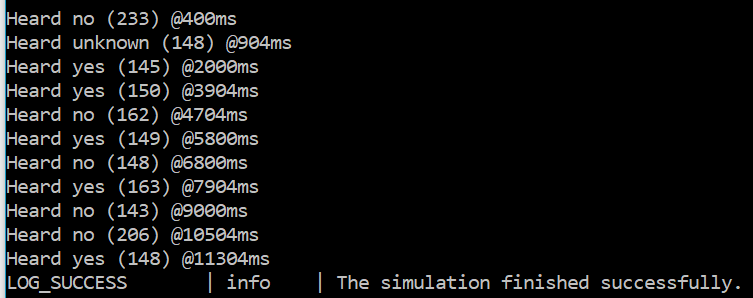

# QUICKSTART IN THE CLOUD

Those instructions are to quickly build and run the demo in the cloud.

For much more details about building and running on different configurations, see the corresponding documentation.

You first need to run an ArmVirtualHardware-1.1.0 image from the  Amazon Web Services (AWS) Marketplace.

Connect to your EC2 instance and follow the below explanations.

#### Clone the repository

`git clone https://github.com/ARM-software/VHT-SystemModeling.git`

#### Install additional python packages

`python3.8 -m pip install numpy matplotlib DyMat scipy`

#### Install OpenModelica

To install [OpenModelica](https://www.openmodelica.org/), follow instruction from [Linux OpenModelica](https://www.openmodelica.org/download/download-linux) pages for installation in the cloud.

Install **stable** . The demo is using `Modelica-4.0` library. It is not installed with the **release**

All libraries must be installed.

You don't need to install the C++ runtime.

After installation, you can do:

`apt-cache search "omlib-.*" | grep "omlib-modelica-4.0.0"`

and look for a `Modelica 4.0.0` library. If you see it, then the next steps should work.

#### Build .axf

`cd VHT-SystemModeling/EchoCanceller`

There is already a pre-built `EchoCanceller.axf` in `EchoCanceller/Objects` but if you want to rebuild it:

Install the [CMSIS](https://github.com/ARM-software/CMSIS_5) packs using CMSIS Build tools:

`cpackget pack add -a -f packlist`

Build the project using CMSIS Build tools:

`cbuild.sh EchoCanceller.MainApp.cprj`

#### Build the Modelica model and run the simulation

Go to the `buildC` folder inside the `EchoCanceller` folder:

`cd BuildC`

`sh buildAndRun.sh`

This script will :

- compile the [Modelica](https://www.openmodelica.org/) model to C code
- compile the C code to generate a [Modelica](https://www.openmodelica.org/) simulator
- Update the parameters of the simulation
- Launch the [Modelica](https://www.openmodelica.org/) simulator (which will launch the [Arm Virtual Hardware](https://arm-software.github.io/VHT/main/overview/html/index.html) )
- Generate a plot from the output of the [Modelica](https://www.openmodelica.org/) simulator using Python

During compilation of the [Modelica](https://www.openmodelica.org/) model to C code, you should see (on the cloud):

```
"/home/ubuntu/VHT-SystemModeling/EchoCanceller/BuildC"
"/home/ubuntu/VHT-SystemModeling/VHTModelicaBlock/ARM/package.mo"
"/home/ubuntu/VHT-SystemModeling/EchoCanceller/EchoCanceller.mo"
true
true
true
true
true
{"/home/ubuntu/VHT-SystemModeling/EchoCanceller/BuildC/Echo.VHTEcho","Echo.VHTEcho_init.xml"}
```

If you see any false, it means one of the commands in the script `echoLinux.mos` has failed.

If this is successful and the [Arm Virtual Hardware](https://arm-software.github.io/VHT/main/overview/html/index.html) has been launched, you should see the output:


It is a mix of output from the [Arm Virtual Hardware](https://arm-software.github.io/VHT/main/overview/html/index.html) and from the [Modelica](https://www.openmodelica.org/) simulator.

Once the simulation has booted, you should start to see some keyword recognition in the console.



When the simulation has ended, the folder should contain the two files:

- YesNoResult.png
- cleanedSignal.wav

`YesNoResult.png` is the far end signal and the keyword recognition.


`cleanedSignal.wav` is the far end signal used for keyword recognition.

You can re-run the simulation with the command:

`sh run.sh`

## Implementation Details

Some [implementation](ImplementationDetails.md) details about the source code are available.
