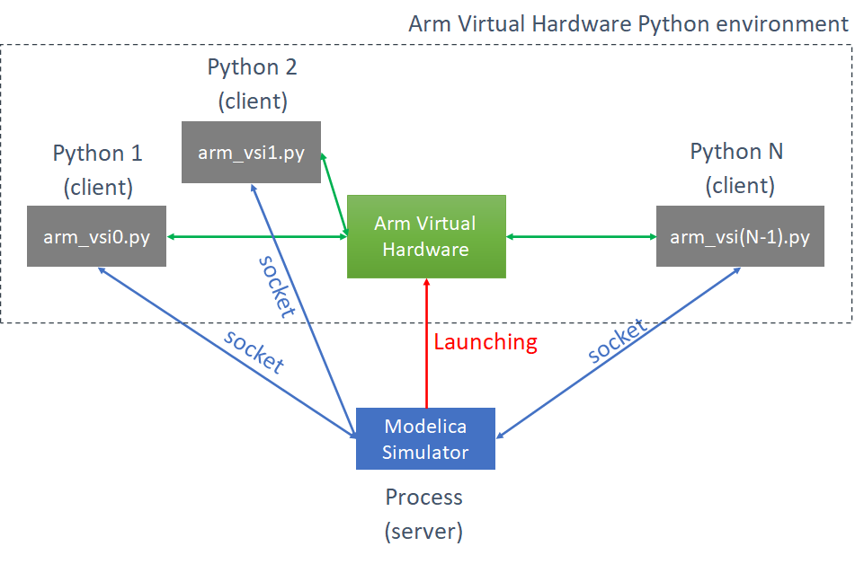

# Echo Canceller and Keyword spotting on Arm Virtual Hardware

This demo is integrating software for an echo canceller and keyword spotting. The code is running on a Cortex-M55 on the [Arm Virtual Hardware](https://arm-software.github.io/VHT/main/overview/html/index.html). The  [Arm Virtual Hardware](https://arm-software.github.io/VHT/main/overview/html/index.html) is interacting with a model of the room acoustic implemented with [OpenModelica](https://www.openmodelica.org/).

- [Quick start in the cloud](Documentation/QUICKSTART.md)
- [More details about how to build and run the demo](Documentation/BUILDANDRUN.md)
  - On the cloud or in local
  - On Linux or on Windows
  - Building from command line or using an IDE
- [Understanding what is inside the demo](Documentation/DEMO.md)

## Quick introduction

For more details, see the above links.

The simulation is containing two simulators:

- The [Arm Virtual Hardware](https://arm-software.github.io/VHT/main/overview/html/index.html) where the Cortex-M55 application is run
- The [OpenModelica](https://www.openmodelica.org/) generated simulator which is implementing the acoustic of the room 

The [OpenModelica](https://www.openmodelica.org/) generated simulator is launching the [Arm Virtual Hardware](https://arm-software.github.io/VHT/main/overview/html/index.html).

The [Arm Virtual Hardware](https://arm-software.github.io/VHT/main/overview/html/index.html) is connecting to the [Modelica](https://www.openmodelica.org/) simulator using sockets.

The [Modelica](https://www.openmodelica.org/) simulator is implementing the acoustic of a room as described on the Modelica architecture diagram.

A `farSource` (background voices) is played through the `nearSpeaker` and captured by the near microphones (either through direct pass from the speaker to the micros or through the room echo - both are modeled with the `roomEcho` block).

The `nearSource` is playing a `yes/no` signal.

We want to detect the `yes/no` keywords and remove the background noise.

The echo canceller and noise reduction (and simplified beamformer) are cleaning the signal before recognition by the Tensor Flow Lite network.

The cleaned signal is also sent back to the far end (and recorded in a `.wav` file)

The `farSource` and `nearSource` are coming from `.wav` files and thus can be easily changed.
